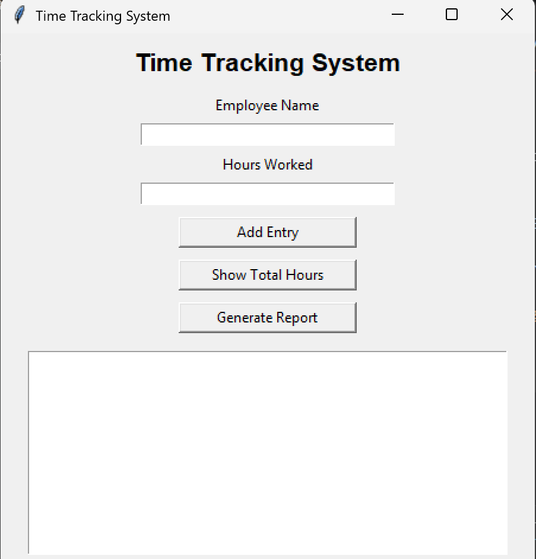
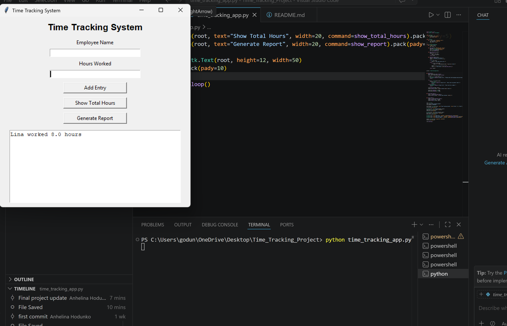
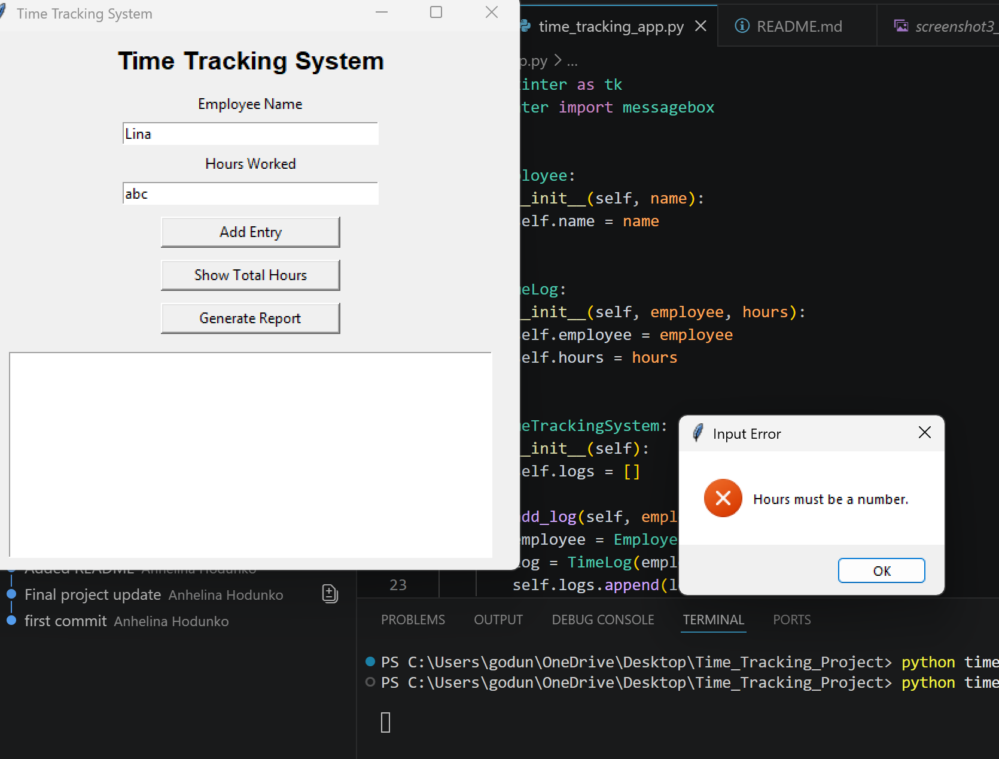
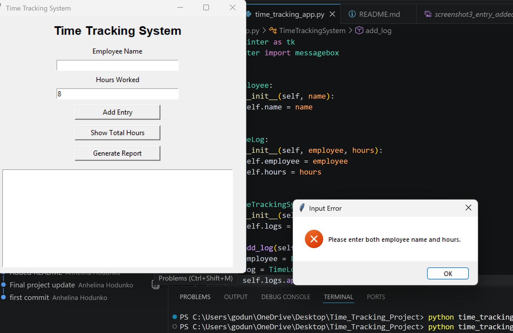

# Time Tracking System

## Project Description
This project is a Python-based Time Tracking System created for a small warehouse or factory company.

The system helps managers track employee work hours and improve payroll accuracy.

## Features
- Graphical User Interface (GUI) using Tkinter
- Add employee work hours
- Calculate total hours worked
- Generate employee reports
- Input validation and error handling
- Uses object-oriented programming with classes
- Uses collections such as lists

## Classes Used
- Employee
- TimeLog
- TimeTrackingSystem

## Technologies
- Python
- Tkinter

## How to Run
1. Open the project folder in VS Code
2. Run the following command:

```bash
python time_tracking_app.py
```

## Author
Anhelina Hodunko

## Trello Board

Project Management Board:
https://trello.com/invite/b/69fbff9fb7bd1e5845b8fe7e/ATTIb362b9a7775a4994b6663c8c9627d10113E277E4/моя-доска-trello


## Screenshots

### Empty Application


### Working Application


### Validation Error


### Empty Fields Error
